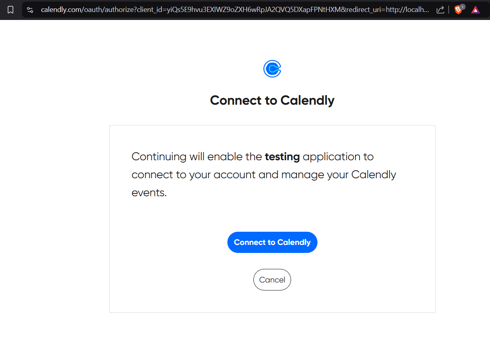
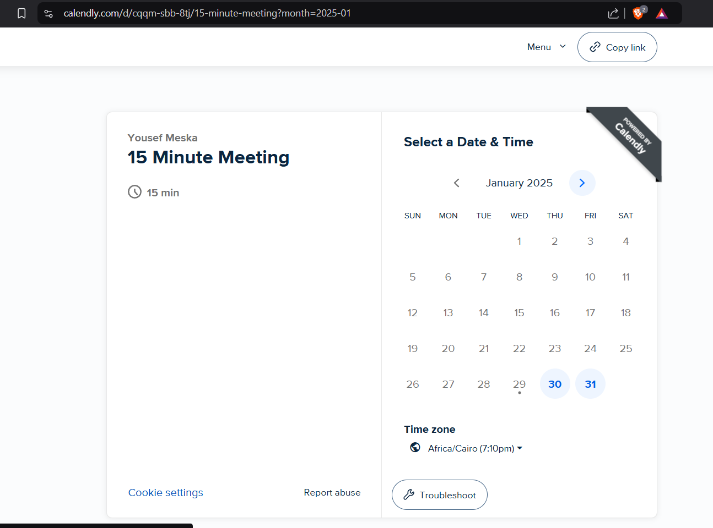

# Calendly integration in Spring boot  [POC]

This is a POC demo of integrating Calendly in Spring boot using OAuth

For API documentation head over to: `http://localhost:8080/swagger-ui/index.html`

## workflow

As there's currently no frontend connected, we're performing the OAuth in a manual way

> You need to register a redirect callback url in [Calendly Developer Apps](https://developer.calendly.com/), with redirect_url = http://localhost:8080/auth/callback


1. First head over to `localhost:8080/auth/calendly` -> will return an authorization uri you can head over to start authorization with Calendly
2. Take that generated url and paste in a browser

You'll be prompted to log in and grant permissions


You will get the token with some other information like this one

```
Authentication successful! 
Access Token: eyJra[Redacted]90g2KFe8ng9uRQ 
User Email: UserResource(avatarUrl=null, createdAt=2021-11-12T20:38:49.747719Z, currentOrganization=https://api.calendly.com/organizations/27eb22b9-c041-4b51-9c34-09d2fb5a3af4, email=mrbomberboy123@gmail.com, locale=en, name=Yousef Meska, resourceType=User, schedulingUrl=https://calendly.com/meska54, slug=meska54, timezone=Africa/Cairo, updatedAt=2025-01-29T15:31:10.012609Z, uri=https://api.calendly.com/users/1ad9f27c-031a-4d67-b486-8638c177d4ec)
```

Once you get the access token, you can use any API tool like Postman to start performing whatever you like
Passing token in `Authorization: Bearer <token>` for example

- getting information about yourself -> `/me`

```
GET localhost:8080/me

response -> 
{
    "resource": {
        "email": "mrbomberboy123@gmail.com",
        "locale": "en",
        "name": "Yousef Meska",
        "slug": "meska54",
        "timezone": "Africa/Cairo",
        "uri": "https://api.calendly.com/users/1ad9f27c-031a-4d67-b486-8638c177d4ec",
        "avatar_url": null,
        "created_at": "2021-11-12T20:38:49.747719Z",
        "current_organization": "https://api.calendly.com/organizations/27eb22b9-c041-4b51-9c34-09d2fb5a3af4",
        "resource_type": "User",
        "scheduling_url": "https://calendly.com/meska54",
        "updated_at": "2025-01-29T15:31:10.012609Z"
    }
}
```

- getting information about event types

```
GET /event-types?userUri=https://api.calendly.com/users/1ad9f27c-031a-4d67-b486-8638c177d4ec

{
    "collection": [
        {
            "uri": "https://api.calendly.com/event_types/a5597ccc-c642-4404-ada6-5a98bfa8cb3b",
            "name": "15 Minute Meeting",
            "active": true,
            "slug": "15min",
            "duration": 15,
            "kind": "solo",
            "type": "StandardEventType",
            "color": "#f8e436",
            "profile": {
                "type": "User",
                "name": "Yousef Meska",
                "owner": "https://api.calendly.com/users/1ad9f27c-031a-4d67-b486-8638c177d4ec"
            },
            "secret": false,
            "locations": null,
            "position": 0,
            "booking_method": "instant",
            "scheduling_url": "https://calendly.com/meska54/15min",
            "duration_options": null,
            "pooling_type": null,
            "created_at": "2021-11-12T20:39:14.699749Z",
            "updated_at": "2021-11-12T20:39:14.699749Z",
            "internal_note": null,
            "description_plain": null,
            "description_html": null,
            "deleted_at": null,
            "admin_managed": false,
            "custom_questions": [
                {
                    "name": "Please share anything that will help prepare for our meeting.",
                    "type": "text",
                    "position": 0,
                    "enabled": true,
                    "required": false,
                    "answer_choices": [],
                    "include_other": false
                }
            ]
        },
        {
            "uri": "https://api.calendly.com/event_types/99bb7bab-4c05-4a31-8af6-32f6ff985312",
            "name": "30 Minute Meeting",
            "active": false,
            "slug": "30min",
            "duration": 30,
            "kind": "solo",
            "type": "StandardEventType",
            "color": "#8247f5",
            "profile": {
                "type": "User",
                "name": "Yousef Meska",
                "owner": "https://api.calendly.com/users/1ad9f27c-031a-4d67-b486-8638c177d4ec"
            },
            "secret": false,
            "locations": null,
            "position": 1,
            "booking_method": "instant",
            "scheduling_url": "https://calendly.com/meska54/30min",
            "duration_options": null,
            "pooling_type": null,
            "created_at": "2021-11-12T20:39:14.737693Z",
            "updated_at": "2021-11-12T20:39:14.737693Z",
            "internal_note": null,
            "description_plain": null,
            "description_html": null,
            "deleted_at": null,
            "admin_managed": false,
            "custom_questions": [
                {
                    "name": "Please share anything that will help prepare for our meeting.",
                    "type": "text",
                    "position": 0,
                    "enabled": true,
                    "required": false,
                    "answer_choices": [],
                    "include_other": false
                }
            ]
        },
        {
            "uri": "https://api.calendly.com/event_types/d4808471-12a9-4344-a8bc-65dfe4d24973",
            "name": "60 Minute Meeting",
            "active": false,
            "slug": "60min",
            "duration": 60,
            "kind": "solo",
            "type": "StandardEventType",
            "color": "#ff4f00",
            "profile": {
                "type": "User",
                "name": "Yousef Meska",
                "owner": "https://api.calendly.com/users/1ad9f27c-031a-4d67-b486-8638c177d4ec"
            },
            "secret": false,
            "locations": null,
            "position": 2,
            "booking_method": "instant",
            "scheduling_url": "https://calendly.com/meska54/60min",
            "duration_options": null,
            "pooling_type": null,
            "created_at": "2021-11-12T20:39:14.771323Z",
            "updated_at": "2021-11-12T20:39:14.771323Z",
            "internal_note": null,
            "description_plain": null,
            "description_html": null,
            "deleted_at": null,
            "admin_managed": false,
            "custom_questions": [
                {
                    "name": "Please share anything that will help prepare for our meeting.",
                    "type": "text",
                    "position": 0,
                    "enabled": true,
                    "required": false,
                    "answer_choices": [],
                    "include_other": false
                }
            ]
        }
    ],
    "pagination": {
        "count": 3,
        "next_page": null,
        "previous_page": null,
        "next_page_token": null,
        "previous_page_token": null
    }
}
```

- Create a Scheduling link
the below example will create a 60 minutes meeting link
```
POST http://localhost:8080/scheduling-link

Body
{
  "max_event_count": 1,
  "owner": "https://api.calendly.com/event_types/d4808471-12a9-4344-a8bc-65dfe4d24973",
  "owner_type": "EventType"
}

Response 
{
    "resource": {
        "owner": "https://api.calendly.com/event_types/d4808471-12a9-4344-a8bc-65dfe4d24973",
        "booking_url": "https://calendly.com/d/crm5-57c-tpf/60-minute-meeting",
        "owner_type": "EventType"
    }
}
}
```



And the same goes for all other endpoints, ofcourse this can be more organized in term of (users, booking, etc)
But this was just a POC.


```

```